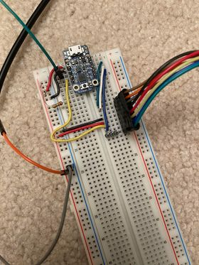

# N64/DualShock

Author: Adrian Padin (padin.adrian@gmail.com)

Last updated: December 13, 2020

## Introduction

This is the results of my work attempting to use a PlayStation 2 DualShock 2 controller on a Nintendo 64.

I used an [Adafruit Trinket Mini](https://learn.adafruit.com/introducing-trinket) to read from the DualShock controller, remap the buttons, and send the data to the N64.

Some of the tasks I accomplished along the way:

* Implementing the beginnings of a SPI library for the Trinket using the Atmel USI (Universal Serial Interface).

* Using bit-banging to read and write from the N64 using the N64's unique single-wire interface.

* Reprogramming the Trinket to use a different bootloader which allows it to boot much faster.

You can read more about the N64, SPI, and other topics by checking out the resources below.

## Prototype

This is a picture of the prototype device:

Pin mapping:
* #0 - MISO (DualShock controller data)
* #1 - MOSI (DualShock controller command)
* #2 - SCLK (DualShock controller clock)
* #3 - SSEL (DualShock controller select)
* #4 - N64 data in/out

Here's a brief description of what's happening here:

* On the left, we have the power and ground lines. These are connected directly to the N64 controller's power, which is at 3.3V. This power line is fed into the VBAT pin on the Trinket. (In my prototype I used a 5V Trinket but I haven't noticed any issues).

* There are two GPIO pins on the left side of the board: #4 is used to communicate with the N64 and has a 22k resistor tied to the power line (since the N64 protocol is open-collector); and #3 (yellow wire in the picture) is the SPI select line.

* The three pins on the right side (green, white, and blue) are MISO, MOSI, and SCLK respectively. These connect to the PS2 controller, which is the large black connector on the bottom right.

## Resources

#### N64 Controller

In order to interface with the N64 I had to program my Trinket to behave like an N64 controller. Since the N64 uses such an odd custom protocol I used code from an Instructables tutorial for reference.

(I did not copy the code directly since it is designed for interfacing with a controller, not the N64 console itself.)

Instructables tutorial by quasse:
  [https://www.instructables.com/Use-an-Arduino-with-an-N64-controller/](https://www.instructables.com/Use-an-Arduino-with-an-N64-controller/)

There's also a great tutorial by qwertymodo.com on reverse-engineering the N64 protocol which was very insightful, especially when it came to the data layer and remapping the button and joystick data.

qwertymodo:
  [http://www.qwertymodo.com/hardware-projects/n64/n64-controller](http://www.qwertymodo.com/hardware-projects/n64/n64-controller)

#### PlayStation 2 / DualShock 2

I have lots of information on the PS2 controller in my embedded_tools library (see below).

#### embedded_tools

The embedded_tools library is a collection of convenient C++ utilities and libraries that I use across several of my projects. I'm continually developing it and adding functionality as I need it, but if you would like to use any part of it or contribute, you are more than welcome.

Github repository:
  [https://github.com/padinadrian/embedded_tools](https://github.com/padinadrian/embedded_tools)

#### ATTiny85 Bootloader

One of the issues I ran into in this project was boot time - the built-in Trinket firmware contains a bootloader that can take several seconds to boot, because it is searching for a USB connection to allow it to upload sketches.

After some digging online I found a bootloader (created by adafruit user hiduino) that allows you to skip the boot process if waking from a cold start, and only enters the bootloader when pressing the reset button. This allowed my code to start running almost immediately (under 100ms) instead of taking 2-3 seconds.

* Repairing or replacing bootloader:
  [https://learn.adafruit.com/introducing-trinket/repairing-bootloader](https://learn.adafruit.com/introducing-trinket/repairing-bootloader)

* New bootloader image:
  [https://forums.adafruit.com/viewtopic.php?f=52&t=54218&p=376898&hilit=trinket+bootloader+skip#p376898](https://forums.adafruit.com/viewtopic.php?f=52&t=54218&p=376898&hilit=trinket+bootloader+skip#p376898)

## To-Do

* Allow an attachable PS2 controller (instead of broken-out cheap controller).
  * https://www.amazon.com/PS2-Controller-Extension-Cable-Playstation-2/dp/B00005MDZ1

* Put together a more sturdy setup (PCB? or solder board?).

* Refactor and migrate N64-related code back into embedded_tools.
